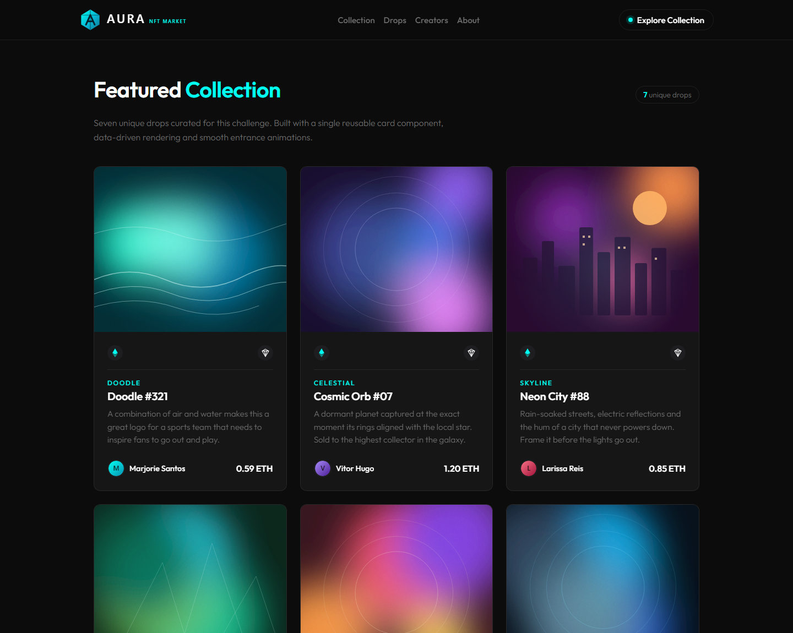
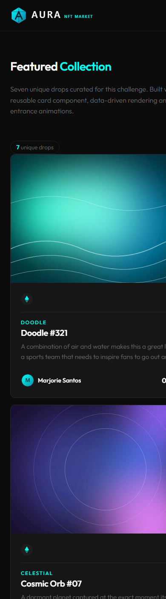
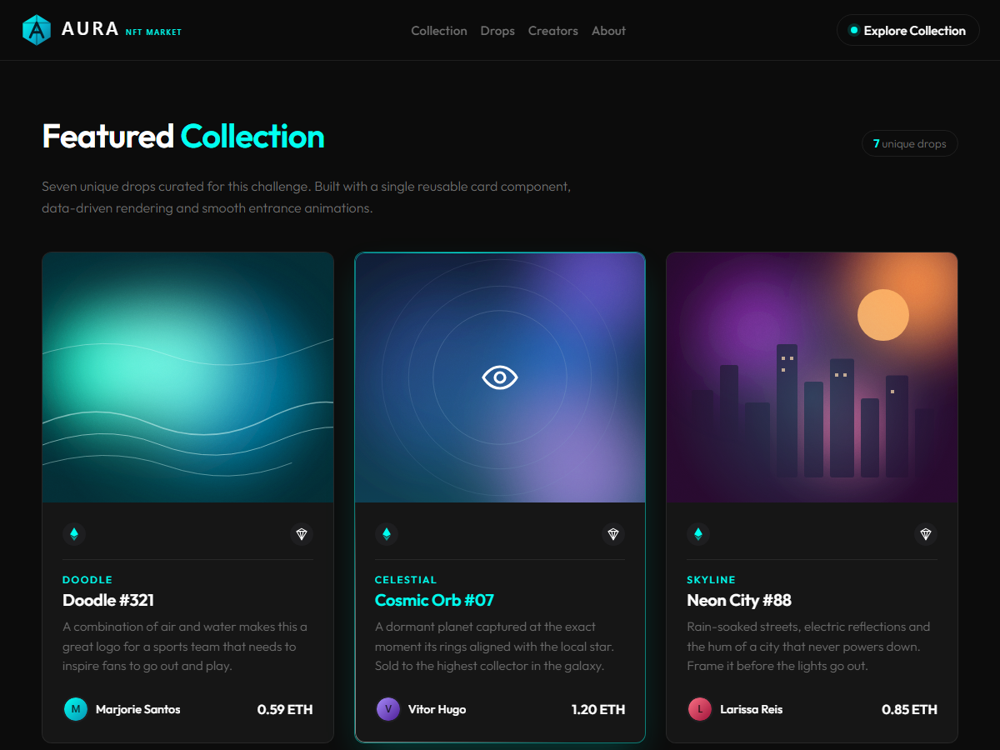

# Aura NFT — Frontend Mentor Challenge

A three-phase NFT preview card challenge built with **HTML, CSS and vanilla JavaScript**. It covers a reusable Card component, a dynamic CardList rendered from data, and a fully responsive Header with a custom AI-generated logo. The interface follows a dark, high-contrast aesthetic with subtle motion and entrance animations.

## Table of Contents

- [Live Demo](#live-demo)
- [Screenshots](#screenshots)
- [Technologies Used](#technologies-used)
- [Project Structure](#project-structure)
- [Getting Started](#getting-started)
- [Usage](#usage)
- [Assets & AI Generation](#assets--ai-generation)
- [Phases](#phases)
- [Responsive Design](#responsive-design)
- [Animations & Effects](#animations--effects)
- [Author](#author)
- [License](#license)

## Live Demo

> **GitHub Pages:** [View Live Demo](https://marjoriesantos-netizen.github.io/projetofabio/)

Live demo is served from the `main` branch root via GitHub Pages.

## Screenshots

### Desktop



### Mobile

<p align="center">
  
</p>

### Card hover effect

Hovering a card lifts it, zooms the artwork, dims it behind a cyan overlay and spins a conic gradient border.



### Logo


> **Note:** Screenshots live in [`docs/screenshots/`](docs/screenshots/). NFT artwork shown in the cards are SVG placeholders — replace them with your own [Leonardo.ai](https://app.leonardo.ai/) generations.

## Technologies Used

- **HTML5** — Semantic, accessible markup
- **CSS3** — Custom properties (design tokens), Flexbox, CSS Grid, responsive media queries
- **Vanilla JavaScript (ES6+)** — Data-driven rendering, DOM manipulation, mobile navigation toggle
- [**Animate.css**](https://animate.style/) — Staggered entrance animations for cards
- [**Google Fonts (Outfit)**](https://fonts.google.com/specimen/Outfit) — Modern geometric sans-serif
- [**Leonardo.ai**](https://leonardo.ai/) — AI image generation for the logo and placeholder NFT artwork
- **Git/GitHub** — Version control with feature branches and conventional English commits
- **GitHub Pages** — Static site hosting

## Project Structure

```text
nft-challenge/
├── assets/
│   ├── icons/              # (reserved for future icons)
│   ├── images/             # NFT artwork + owner avatars (SVG/PNG)
│   └── logo/               # AI-generated logo (logo-mark.svg, logo-full.svg)
├── css/
│   ├── base.css            # Design tokens, resets, global layout
│   ├── card.css            # NFT card component styles + hover/motion effects
│   ├── cardlist.css        # Responsive grid for the collection
│   └── header.css          # Sticky responsive header styles
├── js/
│   ├── data.js             # Single source of truth (NFT_COLLECTION)
│   ├── header.js           # Mobile nav toggle + scroll shadow
│   └── main.js             # Renders cards with staggered animations
├── .gitattributes          # Normalizes line endings (LF)
├── .gitignore              # Ignored files and folders
└── index.html              # Main HTML entry point
```

## Getting Started

### Prerequisites

- [Git](https://git-scm.com/) installed
- A modern web browser (Chrome, Firefox, Edge, Safari)

### Local Setup

1. Clone the repository:

   ```bash
   git clone https://github.com/marjoriesantos-netizen/projetofabio.git
   cd projetofabio
   ```

2. Open `index.html` directly in your browser, or serve it locally with a simple HTTP server:

   ```bash
   # Using Python 3
   python -m http.server 5173

   # Using Node (http-server)
   npx http-server -p 5173
   ```

3. Visit `http://localhost:5173` to view the project.

## Usage

- The CardList is rendered dynamically from `js/data.js`. To add/remove cards, edit `NFT_COLLECTION` inside `js/data.js`.
- To swap placeholder artwork with AI-generated images from [Leonardo.ai](https://app.leonardo.ai/), place your PNG/JPG/SVG files inside `assets/images/` and update the `image` paths in `js/data.js`.
- To update the logo, replace files inside `assets/logo/` (or regenerate via Leonardo.ai).

## Assets & AI Generation

- **Logo:** Custom logo (`AURA — NFT MARKET`) generated with [Leonardo.ai](https://leonardo.ai/). Inspiration drawn from modern marketplace UI (OpenSea/Zora) with a cyan/teal gradient to match the project's accent color (`#00fff0`).
- **NFT Artwork:** Placeholder SVGs were programmatically generated to guarantee visual consistency. These can be replaced with Leonardo.ai outputs at any time (recommended: 700×600 or 1:1 ratio).
- **Avatars:** Initial-based gradient SVG avatars for quick prototyping.

## Phases

| Phase | Branch | Goal | Status |
|---|---|---|---|
| **1.0** | [`feature/card-nft`](../../tree/feature/card-nft) | Build a single NFT Preview Card following the [Frontend Mentor challenge](https://www.frontendmentor.io/challenges/nft-preview-card-component-SbdUL_w0U). Add hover effects and responsive behavior. | ✅ Completed |
| **1.1** | [`feature/card-list`](../../tree/feature/card-list) | Reuse the Card component to create a `CardList` with multiple cards. Add different images/data per card, import artwork (Leonardo.ai), apply [Animate.css](https://animate.style/) entrance/movement animations and ensure responsiveness. | ✅ Completed |
| **1.2** | [`feature/header`](../../tree/feature/header) | Create a custom project logo (Leonardo.ai) with research/inspiration, build a Header that matches the design system, make it responsive (mobile/desktop), and write this complete README. | ✅ Completed |

## Responsive Design

- **Desktop (> 880px):** Full horizontal navigation, call-to-action button visible in header, multi-column grid (auto-fill minmax 300px).
- **Tablet/Mobile (≤ 880px):** Hamburger menu toggle, slide-down mobile navigation panel, single-column-friendly grid spacing.
- **Small Mobile (≤ 380px):** Grid collapses to a single column for optimal readability.
- Layout uses clamp(), relative units (`rem`) and CSS custom properties for fluid scaling.

## Animations & Effects

- **Card entrance:** Staggered `animate__fadeInUp` from Animate.css (110ms delay per card).
- **Card hover:** Subtly lifts (`translateY(-8px)`), gains cyan border glow and soft shadow.
- **Image hover:** Zooms (`scale(1.07)`), desaturates/brightens for depth.
- **Overlay:** Cyan gradient fade-in with eye icon micro-scale animation.
- **Ambient motion:** Floating aura (`aura-float`) and shimmer sweep (`shimmer`) add life without distracting.
- **Conic border:** Rotating cyan conic gradient edge on hover (`card-angle-spin`).
- **Header:** Sticky with blur backdrop, scroll-aware shadow, mobile menu fade-in/down.

## Author

**Marjorie Santos**

- GitHub: [@marjoriesantos-netizen](https://github.com/marjoriesantos-netizen)
- Email: [marjorie.santos@estudante.ifms.edu.br](mailto:marjorie.santos@estudante.ifms.edu.br)

## License

This project is for educational purposes as part of an academic challenge. Feel free to fork, study and adapt it to your own learning goals.
